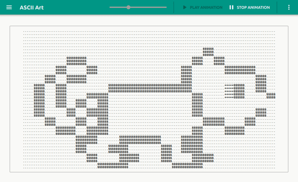

<dl>
    <h1 align="center">
        
        <br><br>ASCII Art<br>
    </h1>
    <h4 align="center">A minimal desktop app for image to ASCII art conversion.</h4>
    <p align="center">
        <a href="#key-features-">Key Features 🍪</a> |
        <a href="#dependencies-">Dependencies 🧬</a> |
        <a href="#build-">Build 🚀</a> |
        <a href="#how-to-use-">How to Use 📃</a> |
        <a href="#solving-problems-">Solving Problems 🐛</a> |
        <a href="#credits-">Credits ✍</a>
    </p>
    <h1 align="center">
        
    </h1>
</dl>

## Key Features 🍪

* Supports JPEG, PNG, PPM, PGM image formats
* Light / Dark theme
* ASCII art symbols size adjustment
* Your own ASCII art symbol style!
* Preserve an image's aspect ratio
* ASCII art animation with duration adjustment
* Export art to .txt file in full image resolution
* Supporting art effects:
  - _Contrast_
  - _Negative_
  - _Sharpen_
  - _Emboss_

## Dependencies 🧬

Minimal requirements:
* Python 3.8.1
* NumPy 1.19.2
* PySide2 5.15.1
* imageio 2.9.0
* pytest 6.2.1

## Build 🚀

#### Download
Download this project manually with download button or run from your command line:
```bash
$ git clone --single-branch --branch ascii-art https://gitlab.fit.cvut.cz/BI-PYT/b201/menshiva.git
```

#### Change working directory
Change your working directory with command:
```bash
$ cd menshiva
```

#### Install dependencies
Run this command to install all necessary dependencies:
```bash
$ pip3 install -r requirements.txt
```

#### Run application
Use this command to run ASCII Art:
```bash
$ python3 app.py
```

#### Test application
Use this command for ASCII Art testing:
```bash
$ pytest
```


## How to Use 📃

#### Basics
1) [Build and run](#build-) application
2) Press the _menu_ button in the toolbar to open image list drawer
3) Press the _Add image_ button to add image
4) In popup dialog:
   - Fill the _Art name_ box **(required)**
   - Choose a path to image from file browser via _Browse_ button **(required)**
   - Choose effects to apply on your art _(optional)_
5) Press the _Add_ button and wait for the image to convert
6) **Enjoy** your ASCII art!

#### Image properties
* To edit your image (change art name or apply new effects):
  1) Press the three dots below the needed image 
  2) Click on _Properties_ button
  3) Apply your changes
  4) Press the _Save_ button and wait for the image to re-convert
* To remove image from list:
  1) Press the three dots below the needed image
  2) Press the _Remove image_ button
* To export image to _.txt_ file:
  1) Press the three dots below the needed image
  2) Press the _Export to text file_ button
  3) Create new text file from opened file browser

#### Animation
* To enable this function you need to add **at least 2 images**
* Animation controls:
  1) Click on _Play animation_ button in a toolbar to start animation
  2) Click on _Stop animation_ button in a toolbar to stop animation

#### Settings
1) Press the three dots in toolbar 
2) Press _Settings_ button

#### Optional utils
* **Adjust ASCII art size** by slider in toolbar
* Switch between **Light and Dark** theme in [Settings](#Settings) in _Theme_ section
* **Adjust animation duration** by slider in [Settings](#Settings) in _Animation duration_ section
* **Style ASCII art** with your own symbols in [Settings](#Settings) in _Grayscale level_ section:
  - You need to enter the sequence of symbols from darkest to lightest
  - Your ASCII art will be shown by these symbols

## Solving Problems 🐛

#### Could not load the Qt platform plugin
* If you are getting this error while trying to run _app.py_:
```bash
Could not load the Qt platform plugin "xcb" in "" even though it was found.
This application failed to start because no Qt platform plugin could be initialized. Reinstalling the application may fix this problem.

Aborted (core dumped)
```
Then you need to **install** _libxcb-xinerama0_ via command line:
```bash
$ sudo apt-get install libxcb-xinerama0
```

## Credits ✍

#### Third-party libraries
* [NumPy](https://numpy.org/)
* [Qt for Python](https://wiki.qt.io/Qt_for_Python)
* [imageio](https://imageio.github.io/)

#### Used algorithms
* [Image scaling algorithm](https://en.wikipedia.org/wiki/Image_scaling#Nearest-neighbor_interpolation)
* [RGB to grayscale preserving luminance algorithm](https://en.wikipedia.org/wiki/Grayscale#Colorimetric_(perceptual_luminance-preserving)_conversion_to_grayscale)
* [Contrast effect algorithm](https://en.wikipedia.org/wiki/Contrast_(vision))
* Convolution (image kernel):
  - [Image kernel](https://en.wikipedia.org/wiki/Kernel_(image_processing))
  - [Kernel visualisation](https://setosa.io/ev/image-kernels/)
  - [Relation between image kernel and Fourier transform](https://en.wikipedia.org/wiki/Convolution_theorem)
  - [Discrete Fourier Transform](https://numpy.org/doc/stable/reference/routines.fft.html#background-information)

#### Related
* Special thanks to [Freepik](https://www.flaticon.com/authors/freepik) for app icon!

#### Author
* Ivan Menshikov (menshiva@fit.cvut.cz)